# G2M insight for Cab Investment firm

XYX wants to invest in Cab industry as per Go-To-Market strategy. XYZ needs to indenitfy the right company to make investment. 

## Dataset information

Time period of data - 31/02/2016 - 31/12/2018
<br/>
Cab_Data - Transaction for 2 cab companies
<br />
Customer_ID - Customer's demographic details
<br />
Transaction_ID - Transaction to Customer Mapping and Payment mode
<br />City - US city population and number of cab users


```python
import numpy as np
import pandas as pd
import matplotlib.pyplot as plt
from datetime import datetime
import seaborn as sb

%matplotlib inline
```

## Reading the Data Files


```python
cabData = pd.read_csv("DataSets/Cab_Data.csv")
customerData = pd.read_csv("DataSets/Customer_ID.csv")
transactionData = pd.read_csv("DataSets/Transaction_ID.csv")
cityData = pd.read_csv("DataSets/City.csv")
```


```python
cabData.head()
```


<div>
<style scoped>
    .dataframe tbody tr th:only-of-type {
        vertical-align: middle;
    }

    .dataframe tbody tr th {
        vertical-align: top;
    }

    .dataframe thead th {
        text-align: right;
    }
</style>
<table border="1" class="dataframe">
  <thead>
    <tr style="text-align: right;">
      <th></th>
      <th>Transaction ID</th>
      <th>Date of Travel</th>
      <th>Company</th>
      <th>City</th>
      <th>KM Travelled</th>
      <th>Price Charged</th>
      <th>Cost of Trip</th>
    </tr>
  </thead>
  <tbody>
    <tr>
      <th>0</th>
      <td>10000011</td>
      <td>42377</td>
      <td>Pink Cab</td>
      <td>ATLANTA GA</td>
      <td>30.45</td>
      <td>370.95</td>
      <td>313.635</td>
    </tr>
    <tr>
      <th>1</th>
      <td>10000012</td>
      <td>42375</td>
      <td>Pink Cab</td>
      <td>ATLANTA GA</td>
      <td>28.62</td>
      <td>358.52</td>
      <td>334.854</td>
    </tr>
    <tr>
      <th>2</th>
      <td>10000013</td>
      <td>42371</td>
      <td>Pink Cab</td>
      <td>ATLANTA GA</td>
      <td>9.04</td>
      <td>125.20</td>
      <td>97.632</td>
    </tr>
    <tr>
      <th>3</th>
      <td>10000014</td>
      <td>42376</td>
      <td>Pink Cab</td>
      <td>ATLANTA GA</td>
      <td>33.17</td>
      <td>377.40</td>
      <td>351.602</td>
    </tr>
    <tr>
      <th>4</th>
      <td>10000015</td>
      <td>42372</td>
      <td>Pink Cab</td>
      <td>ATLANTA GA</td>
      <td>8.73</td>
      <td>114.62</td>
      <td>97.776</td>
    </tr>
  </tbody>
</table>
</div>


```python
customerData.head()
```


<div>
<style scoped>
    .dataframe tbody tr th:only-of-type {
        vertical-align: middle;
    }

    .dataframe tbody tr th {
        vertical-align: top;
    }

    .dataframe thead th {
        text-align: right;
    }
</style>
<table border="1" class="dataframe">
  <thead>
    <tr style="text-align: right;">
      <th></th>
      <th>Customer ID</th>
      <th>Gender</th>
      <th>Age</th>
      <th>Income (USD/Month)</th>
    </tr>
  </thead>
  <tbody>
    <tr>
      <th>0</th>
      <td>29290</td>
      <td>Male</td>
      <td>28</td>
      <td>10813</td>
    </tr>
    <tr>
      <th>1</th>
      <td>27703</td>
      <td>Male</td>
      <td>27</td>
      <td>9237</td>
    </tr>
    <tr>
      <th>2</th>
      <td>28712</td>
      <td>Male</td>
      <td>53</td>
      <td>11242</td>
    </tr>
    <tr>
      <th>3</th>
      <td>28020</td>
      <td>Male</td>
      <td>23</td>
      <td>23327</td>
    </tr>
    <tr>
      <th>4</th>
      <td>27182</td>
      <td>Male</td>
      <td>33</td>
      <td>8536</td>
    </tr>
  </tbody>
</table>
</div>


```python
transactionData.head()
```


<div>
<style scoped>
    .dataframe tbody tr th:only-of-type {
        vertical-align: middle;
    }

    .dataframe tbody tr th {
        vertical-align: top;
    }

    .dataframe thead th {
        text-align: right;
    }
</style>
<table border="1" class="dataframe">
  <thead>
    <tr style="text-align: right;">
      <th></th>
      <th>Transaction ID</th>
      <th>Customer ID</th>
      <th>Payment_Mode</th>
    </tr>
  </thead>
  <tbody>
    <tr>
      <th>0</th>
      <td>10000011</td>
      <td>29290</td>
      <td>Card</td>
    </tr>
    <tr>
      <th>1</th>
      <td>10000012</td>
      <td>27703</td>
      <td>Card</td>
    </tr>
    <tr>
      <th>2</th>
      <td>10000013</td>
      <td>28712</td>
      <td>Cash</td>
    </tr>
    <tr>
      <th>3</th>
      <td>10000014</td>
      <td>28020</td>
      <td>Cash</td>
    </tr>
    <tr>
      <th>4</th>
      <td>10000015</td>
      <td>27182</td>
      <td>Card</td>
    </tr>
  </tbody>
</table>
</div>


```python
cityData.head()
```


<div>
<style scoped>
    .dataframe tbody tr th:only-of-type {
        vertical-align: middle;
    }

    .dataframe tbody tr th {
        vertical-align: top;
    }

    .dataframe thead th {
        text-align: right;
    }
</style>
<table border="1" class="dataframe">
  <thead>
    <tr style="text-align: right;">
      <th></th>
      <th>City</th>
      <th>Population</th>
      <th>Users</th>
    </tr>
  </thead>
  <tbody>
    <tr>
      <th>0</th>
      <td>NEW YORK NY</td>
      <td>8,405,837</td>
      <td>302,149</td>
    </tr>
    <tr>
      <th>1</th>
      <td>CHICAGO IL</td>
      <td>1,955,130</td>
      <td>164,468</td>
    </tr>
    <tr>
      <th>2</th>
      <td>LOS ANGELES CA</td>
      <td>1,595,037</td>
      <td>144,132</td>
    </tr>
    <tr>
      <th>3</th>
      <td>MIAMI FL</td>
      <td>1,339,155</td>
      <td>17,675</td>
    </tr>
    <tr>
      <th>4</th>
      <td>SILICON VALLEY</td>
      <td>1,177,609</td>
      <td>27,247</td>
    </tr>
  </tbody>
</table>
</div>


```python
print(cabData.info())
print(customerData.info())
print(transactionData.info())
print(cityData.info())
```

    <class 'pandas.core.frame.DataFrame'>
    RangeIndex: 359392 entries, 0 to 359391
    Data columns (total 7 columns):
     #   Column          Non-Null Count   Dtype  
    ---  ------          --------------   -----  
     0   Transaction ID  359392 non-null  int64  
     1   Date of Travel  359392 non-null  int64  
     2   Company         359392 non-null  object 
     3   City            359392 non-null  object 
     4   KM Travelled    359392 non-null  float64
     5   Price Charged   359392 non-null  float64
     6   Cost of Trip    359392 non-null  float64
    dtypes: float64(3), int64(2), object(2)
    memory usage: 19.2+ MB
    None
    <class 'pandas.core.frame.DataFrame'>
    RangeIndex: 49171 entries, 0 to 49170
    Data columns (total 4 columns):
     #   Column              Non-Null Count  Dtype 
    ---  ------              --------------  ----- 
     0   Customer ID         49171 non-null  int64 
     1   Gender              49171 non-null  object
     2   Age                 49171 non-null  int64 
     3   Income (USD/Month)  49171 non-null  int64 
    dtypes: int64(3), object(1)
    memory usage: 1.5+ MB
    None
    <class 'pandas.core.frame.DataFrame'>
    RangeIndex: 440098 entries, 0 to 440097
    Data columns (total 3 columns):
     #   Column          Non-Null Count   Dtype 
    ---  ------          --------------   ----- 
     0   Transaction ID  440098 non-null  int64 
     1   Customer ID     440098 non-null  int64 
     2   Payment_Mode    440098 non-null  object
    dtypes: int64(2), object(1)
    memory usage: 10.1+ MB
    None
    <class 'pandas.core.frame.DataFrame'>
    RangeIndex: 20 entries, 0 to 19
    Data columns (total 3 columns):
     #   Column      Non-Null Count  Dtype 
    ---  ------      --------------  ----- 
     0   City        20 non-null     object
     1   Population  20 non-null     object
     2   Users       20 non-null     object
    dtypes: object(3)
    memory usage: 608.0+ bytes
    None
    

#### The Cab Data date format is not in the Year-Month-Date format. Adding a new column with the correct format.


```python
cabData["Travel Date"] = pd.TimedeltaIndex(cabData["Date of Travel"].astype(int), unit='d') + datetime(1900, 1, 1)
cabData.head()
```


<div>
<style scoped>
    .dataframe tbody tr th:only-of-type {
        vertical-align: middle;
    }

    .dataframe tbody tr th {
        vertical-align: top;
    }

    .dataframe thead th {
        text-align: right;
    }
</style>
<table border="1" class="dataframe">
  <thead>
    <tr style="text-align: right;">
      <th></th>
      <th>Transaction ID</th>
      <th>Date of Travel</th>
      <th>Company</th>
      <th>City</th>
      <th>KM Travelled</th>
      <th>Price Charged</th>
      <th>Cost of Trip</th>
      <th>Travel Date</th>
    </tr>
  </thead>
  <tbody>
    <tr>
      <th>0</th>
      <td>10000011</td>
      <td>42377</td>
      <td>Pink Cab</td>
      <td>ATLANTA GA</td>
      <td>30.45</td>
      <td>370.95</td>
      <td>313.635</td>
      <td>2016-01-10</td>
    </tr>
    <tr>
      <th>1</th>
      <td>10000012</td>
      <td>42375</td>
      <td>Pink Cab</td>
      <td>ATLANTA GA</td>
      <td>28.62</td>
      <td>358.52</td>
      <td>334.854</td>
      <td>2016-01-08</td>
    </tr>
    <tr>
      <th>2</th>
      <td>10000013</td>
      <td>42371</td>
      <td>Pink Cab</td>
      <td>ATLANTA GA</td>
      <td>9.04</td>
      <td>125.20</td>
      <td>97.632</td>
      <td>2016-01-04</td>
    </tr>
    <tr>
      <th>3</th>
      <td>10000014</td>
      <td>42376</td>
      <td>Pink Cab</td>
      <td>ATLANTA GA</td>
      <td>33.17</td>
      <td>377.40</td>
      <td>351.602</td>
      <td>2016-01-09</td>
    </tr>
    <tr>
      <th>4</th>
      <td>10000015</td>
      <td>42372</td>
      <td>Pink Cab</td>
      <td>ATLANTA GA</td>
      <td>8.73</td>
      <td>114.62</td>
      <td>97.776</td>
      <td>2016-01-05</td>
    </tr>
  </tbody>
</table>
</div>


## Merging dateframes


```python
customerMerge = pd.merge(customerData, transactionData, on='Customer ID')
cityMerge = pd.merge(cabData, cityData, on='City')
df = pd.merge(cityMerge, customerMerge, on='Transaction ID')
```


```python
# df.to_csv('completeData.csv') 
```


```python
df.head()
```


<div>
<style scoped>
    .dataframe tbody tr th:only-of-type {
        vertical-align: middle;
    }

    .dataframe tbody tr th {
        vertical-align: top;
    }

    .dataframe thead th {
        text-align: right;
    }
</style>
<table border="1" class="dataframe">
  <thead>
    <tr style="text-align: right;">
      <th></th>
      <th>Transaction ID</th>
      <th>Date of Travel</th>
      <th>Company</th>
      <th>City</th>
      <th>KM Travelled</th>
      <th>Price Charged</th>
      <th>Cost of Trip</th>
      <th>Travel Date</th>
      <th>Population</th>
      <th>Users</th>
      <th>Customer ID</th>
      <th>Gender</th>
      <th>Age</th>
      <th>Income (USD/Month)</th>
      <th>Payment_Mode</th>
    </tr>
  </thead>
  <tbody>
    <tr>
      <th>0</th>
      <td>10000011</td>
      <td>42377</td>
      <td>Pink Cab</td>
      <td>ATLANTA GA</td>
      <td>30.45</td>
      <td>370.95</td>
      <td>313.635</td>
      <td>2016-01-10</td>
      <td>814,885</td>
      <td>24,701</td>
      <td>29290</td>
      <td>Male</td>
      <td>28</td>
      <td>10813</td>
      <td>Card</td>
    </tr>
    <tr>
      <th>1</th>
      <td>10000012</td>
      <td>42375</td>
      <td>Pink Cab</td>
      <td>ATLANTA GA</td>
      <td>28.62</td>
      <td>358.52</td>
      <td>334.854</td>
      <td>2016-01-08</td>
      <td>814,885</td>
      <td>24,701</td>
      <td>27703</td>
      <td>Male</td>
      <td>27</td>
      <td>9237</td>
      <td>Card</td>
    </tr>
    <tr>
      <th>2</th>
      <td>10000013</td>
      <td>42371</td>
      <td>Pink Cab</td>
      <td>ATLANTA GA</td>
      <td>9.04</td>
      <td>125.20</td>
      <td>97.632</td>
      <td>2016-01-04</td>
      <td>814,885</td>
      <td>24,701</td>
      <td>28712</td>
      <td>Male</td>
      <td>53</td>
      <td>11242</td>
      <td>Cash</td>
    </tr>
    <tr>
      <th>3</th>
      <td>10000014</td>
      <td>42376</td>
      <td>Pink Cab</td>
      <td>ATLANTA GA</td>
      <td>33.17</td>
      <td>377.40</td>
      <td>351.602</td>
      <td>2016-01-09</td>
      <td>814,885</td>
      <td>24,701</td>
      <td>28020</td>
      <td>Male</td>
      <td>23</td>
      <td>23327</td>
      <td>Cash</td>
    </tr>
    <tr>
      <th>4</th>
      <td>10000015</td>
      <td>42372</td>
      <td>Pink Cab</td>
      <td>ATLANTA GA</td>
      <td>8.73</td>
      <td>114.62</td>
      <td>97.776</td>
      <td>2016-01-05</td>
      <td>814,885</td>
      <td>24,701</td>
      <td>27182</td>
      <td>Male</td>
      <td>33</td>
      <td>8536</td>
      <td>Card</td>
    </tr>
  </tbody>
</table>
</div>


```python
pd.isnull(df).sum(axis=0)
```


    Transaction ID        0
    Date of Travel        0
    Company               0
    City                  0
    KM Travelled          0
    Price Charged         0
    Cost of Trip          0
    Travel Date           0
    Population            0
    Users                 0
    Customer ID           0
    Gender                0
    Age                   0
    Income (USD/Month)    0
    Payment_Mode          0
    dtype: int64


```python
df.info()
```

    <class 'pandas.core.frame.DataFrame'>
    Int64Index: 359392 entries, 0 to 359391
    Data columns (total 15 columns):
     #   Column              Non-Null Count   Dtype         
    ---  ------              --------------   -----         
     0   Transaction ID      359392 non-null  int64         
     1   Date of Travel      359392 non-null  int64         
     2   Company             359392 non-null  object        
     3   City                359392 non-null  object        
     4   KM Travelled        359392 non-null  float64       
     5   Price Charged       359392 non-null  float64       
     6   Cost of Trip        359392 non-null  float64       
     7   Travel Date         359392 non-null  datetime64[ns]
     8   Population          359392 non-null  object        
     9   Users               359392 non-null  object        
     10  Customer ID         359392 non-null  int64         
     11  Gender              359392 non-null  object        
     12  Age                 359392 non-null  int64         
     13  Income (USD/Month)  359392 non-null  int64         
     14  Payment_Mode        359392 non-null  object        
    dtypes: datetime64[ns](1), float64(3), int64(5), object(6)
    memory usage: 43.9+ MB
    


```python
df.corr()
```


<div>
<style scoped>
    .dataframe tbody tr th:only-of-type {
        vertical-align: middle;
    }

    .dataframe tbody tr th {
        vertical-align: top;
    }

    .dataframe thead th {
        text-align: right;
    }
</style>
<table border="1" class="dataframe">
  <thead>
    <tr style="text-align: right;">
      <th></th>
      <th>Transaction ID</th>
      <th>Date of Travel</th>
      <th>KM Travelled</th>
      <th>Price Charged</th>
      <th>Cost of Trip</th>
      <th>Customer ID</th>
      <th>Age</th>
      <th>Income (USD/Month)</th>
    </tr>
  </thead>
  <tbody>
    <tr>
      <th>Transaction ID</th>
      <td>1.000000</td>
      <td>0.993030</td>
      <td>-0.001429</td>
      <td>-0.052902</td>
      <td>-0.003462</td>
      <td>-0.016912</td>
      <td>-0.001267</td>
      <td>-0.001570</td>
    </tr>
    <tr>
      <th>Date of Travel</th>
      <td>0.993030</td>
      <td>1.000000</td>
      <td>-0.001621</td>
      <td>-0.055559</td>
      <td>-0.004484</td>
      <td>-0.017653</td>
      <td>-0.001346</td>
      <td>-0.001368</td>
    </tr>
    <tr>
      <th>KM Travelled</th>
      <td>-0.001429</td>
      <td>-0.001621</td>
      <td>1.000000</td>
      <td>0.835753</td>
      <td>0.981848</td>
      <td>0.000389</td>
      <td>-0.000369</td>
      <td>-0.000544</td>
    </tr>
    <tr>
      <th>Price Charged</th>
      <td>-0.052902</td>
      <td>-0.055559</td>
      <td>0.835753</td>
      <td>1.000000</td>
      <td>0.859812</td>
      <td>-0.177324</td>
      <td>-0.003084</td>
      <td>0.003228</td>
    </tr>
    <tr>
      <th>Cost of Trip</th>
      <td>-0.003462</td>
      <td>-0.004484</td>
      <td>0.981848</td>
      <td>0.859812</td>
      <td>1.000000</td>
      <td>0.003077</td>
      <td>-0.000189</td>
      <td>-0.000633</td>
    </tr>
    <tr>
      <th>Customer ID</th>
      <td>-0.016912</td>
      <td>-0.017653</td>
      <td>0.000389</td>
      <td>-0.177324</td>
      <td>0.003077</td>
      <td>1.000000</td>
      <td>-0.004735</td>
      <td>-0.013608</td>
    </tr>
    <tr>
      <th>Age</th>
      <td>-0.001267</td>
      <td>-0.001346</td>
      <td>-0.000369</td>
      <td>-0.003084</td>
      <td>-0.000189</td>
      <td>-0.004735</td>
      <td>1.000000</td>
      <td>0.003907</td>
    </tr>
    <tr>
      <th>Income (USD/Month)</th>
      <td>-0.001570</td>
      <td>-0.001368</td>
      <td>-0.000544</td>
      <td>0.003228</td>
      <td>-0.000633</td>
      <td>-0.013608</td>
      <td>0.003907</td>
      <td>1.000000</td>
    </tr>
  </tbody>
</table>
</div>


```python
plt.figure(figsize=(40,30))

ax = sb.countplot(df['City'], hue="Company", data=df, palette=["#FFC0CB","#FFFAA0"])
ax.set_title("Total Rides by City", fontsize=20)
for p in ax.patches:
    ax.annotate(f'\n{p.get_height()}', (p.get_x()+0.2, p.get_height()), ha='center', va='top', color='black', size=14)
plt.show()
```


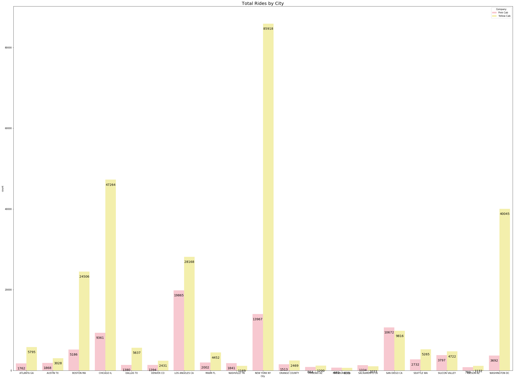


```python
plt.figure(figsize=(15, 15))
plt.title("Distribution of Total Rides by City")
df["City"].value_counts().plot(kind = 'pie')
plt.axes().set_ylabel('')
```

    C:\ProgramData\Anaconda3\lib\site-packages\ipykernel_launcher.py:4: MatplotlibDeprecationWarning: Adding an axes using the same arguments as a previous axes currently reuses the earlier instance.  In a future version, a new instance will always be created and returned.  Meanwhile, this warning can be suppressed, and the future behavior ensured, by passing a unique label to each axes instance.
      after removing the cwd from sys.path.
    


    Text(0, 0.5, '')


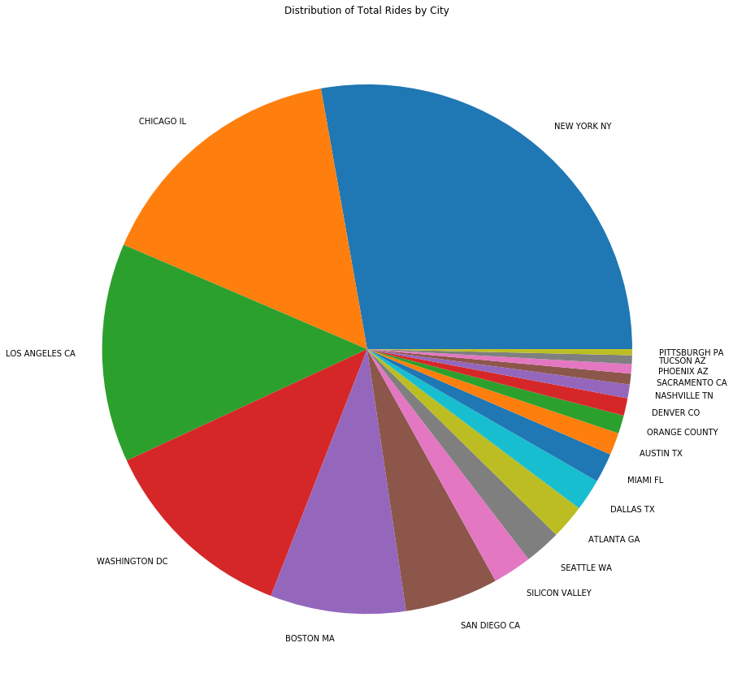


## Profit


```python
df["Profit"] = df["Price Charged"] - df["Cost of Trip"]
df.head()
```


<div>
<style scoped>
    .dataframe tbody tr th:only-of-type {
        vertical-align: middle;
    }

    .dataframe tbody tr th {
        vertical-align: top;
    }

    .dataframe thead th {
        text-align: right;
    }
</style>
<table border="1" class="dataframe">
  <thead>
    <tr style="text-align: right;">
      <th></th>
      <th>Transaction ID</th>
      <th>Date of Travel</th>
      <th>Company</th>
      <th>City</th>
      <th>KM Travelled</th>
      <th>Price Charged</th>
      <th>Cost of Trip</th>
      <th>Travel Date</th>
      <th>Population</th>
      <th>Users</th>
      <th>Customer ID</th>
      <th>Gender</th>
      <th>Age</th>
      <th>Income (USD/Month)</th>
      <th>Payment_Mode</th>
      <th>Profit</th>
    </tr>
  </thead>
  <tbody>
    <tr>
      <th>0</th>
      <td>10000011</td>
      <td>42377</td>
      <td>Pink Cab</td>
      <td>ATLANTA GA</td>
      <td>30.45</td>
      <td>370.95</td>
      <td>313.635</td>
      <td>2016-01-10</td>
      <td>814,885</td>
      <td>24,701</td>
      <td>29290</td>
      <td>Male</td>
      <td>28</td>
      <td>10813</td>
      <td>Card</td>
      <td>57.315</td>
    </tr>
    <tr>
      <th>1</th>
      <td>10000012</td>
      <td>42375</td>
      <td>Pink Cab</td>
      <td>ATLANTA GA</td>
      <td>28.62</td>
      <td>358.52</td>
      <td>334.854</td>
      <td>2016-01-08</td>
      <td>814,885</td>
      <td>24,701</td>
      <td>27703</td>
      <td>Male</td>
      <td>27</td>
      <td>9237</td>
      <td>Card</td>
      <td>23.666</td>
    </tr>
    <tr>
      <th>2</th>
      <td>10000013</td>
      <td>42371</td>
      <td>Pink Cab</td>
      <td>ATLANTA GA</td>
      <td>9.04</td>
      <td>125.20</td>
      <td>97.632</td>
      <td>2016-01-04</td>
      <td>814,885</td>
      <td>24,701</td>
      <td>28712</td>
      <td>Male</td>
      <td>53</td>
      <td>11242</td>
      <td>Cash</td>
      <td>27.568</td>
    </tr>
    <tr>
      <th>3</th>
      <td>10000014</td>
      <td>42376</td>
      <td>Pink Cab</td>
      <td>ATLANTA GA</td>
      <td>33.17</td>
      <td>377.40</td>
      <td>351.602</td>
      <td>2016-01-09</td>
      <td>814,885</td>
      <td>24,701</td>
      <td>28020</td>
      <td>Male</td>
      <td>23</td>
      <td>23327</td>
      <td>Cash</td>
      <td>25.798</td>
    </tr>
    <tr>
      <th>4</th>
      <td>10000015</td>
      <td>42372</td>
      <td>Pink Cab</td>
      <td>ATLANTA GA</td>
      <td>8.73</td>
      <td>114.62</td>
      <td>97.776</td>
      <td>2016-01-05</td>
      <td>814,885</td>
      <td>24,701</td>
      <td>27182</td>
      <td>Male</td>
      <td>33</td>
      <td>8536</td>
      <td>Card</td>
      <td>16.844</td>
    </tr>
  </tbody>
</table>
</div>


### Profit comparisons for Pink vs Yellow Cab


```python
profitData = df.groupby("Company").mean()
profitData.head()
```


<div>
<style scoped>
    .dataframe tbody tr th:only-of-type {
        vertical-align: middle;
    }

    .dataframe tbody tr th {
        vertical-align: top;
    }

    .dataframe thead th {
        text-align: right;
    }
</style>
<table border="1" class="dataframe">
  <thead>
    <tr style="text-align: right;">
      <th></th>
      <th>Transaction ID</th>
      <th>Date of Travel</th>
      <th>KM Travelled</th>
      <th>Price Charged</th>
      <th>Cost of Trip</th>
      <th>Customer ID</th>
      <th>Age</th>
      <th>Income (USD/Month)</th>
      <th>Profit</th>
    </tr>
    <tr>
      <th>Company</th>
      <th></th>
      <th></th>
      <th></th>
      <th></th>
      <th></th>
      <th></th>
      <th></th>
      <th></th>
      <th></th>
    </tr>
  </thead>
  <tbody>
    <tr>
      <th>Pink Cab</th>
      <td>1.022394e+07</td>
      <td>42975.183435</td>
      <td>22.559917</td>
      <td>310.800856</td>
      <td>248.148682</td>
      <td>18422.581577</td>
      <td>35.322414</td>
      <td>15059.047137</td>
      <td>62.652174</td>
    </tr>
    <tr>
      <th>Yellow Cab</th>
      <td>1.021978e+07</td>
      <td>42960.640022</td>
      <td>22.569517</td>
      <td>458.181990</td>
      <td>297.922004</td>
      <td>19428.831732</td>
      <td>35.341112</td>
      <td>15045.669817</td>
      <td>160.259986</td>
    </tr>
  </tbody>
</table>
</div>


```python
companyData = df.groupby("Company").count()


companyData.head()
```


<div>
<style scoped>
    .dataframe tbody tr th:only-of-type {
        vertical-align: middle;
    }

    .dataframe tbody tr th {
        vertical-align: top;
    }

    .dataframe thead th {
        text-align: right;
    }
</style>
<table border="1" class="dataframe">
  <thead>
    <tr style="text-align: right;">
      <th></th>
      <th>Transaction ID</th>
      <th>Date of Travel</th>
      <th>City</th>
      <th>KM Travelled</th>
      <th>Price Charged</th>
      <th>Cost of Trip</th>
      <th>Travel Date</th>
      <th>Population</th>
      <th>Users</th>
      <th>Customer ID</th>
      <th>Gender</th>
      <th>Age</th>
      <th>Income (USD/Month)</th>
      <th>Payment_Mode</th>
      <th>Profit</th>
    </tr>
    <tr>
      <th>Company</th>
      <th></th>
      <th></th>
      <th></th>
      <th></th>
      <th></th>
      <th></th>
      <th></th>
      <th></th>
      <th></th>
      <th></th>
      <th></th>
      <th></th>
      <th></th>
      <th></th>
      <th></th>
    </tr>
  </thead>
  <tbody>
    <tr>
      <th>Pink Cab</th>
      <td>84711</td>
      <td>84711</td>
      <td>84711</td>
      <td>84711</td>
      <td>84711</td>
      <td>84711</td>
      <td>84711</td>
      <td>84711</td>
      <td>84711</td>
      <td>84711</td>
      <td>84711</td>
      <td>84711</td>
      <td>84711</td>
      <td>84711</td>
      <td>84711</td>
    </tr>
    <tr>
      <th>Yellow Cab</th>
      <td>274681</td>
      <td>274681</td>
      <td>274681</td>
      <td>274681</td>
      <td>274681</td>
      <td>274681</td>
      <td>274681</td>
      <td>274681</td>
      <td>274681</td>
      <td>274681</td>
      <td>274681</td>
      <td>274681</td>
      <td>274681</td>
      <td>274681</td>
      <td>274681</td>
    </tr>
  </tbody>
</table>
</div>


```python
companyData.info()
```

    <class 'pandas.core.frame.DataFrame'>
    Index: 2 entries, Pink Cab to Yellow Cab
    Data columns (total 15 columns):
     #   Column              Non-Null Count  Dtype
    ---  ------              --------------  -----
     0   Transaction ID      2 non-null      int64
     1   Date of Travel      2 non-null      int64
     2   City                2 non-null      int64
     3   KM Travelled        2 non-null      int64
     4   Price Charged       2 non-null      int64
     5   Cost of Trip        2 non-null      int64
     6   Travel Date         2 non-null      int64
     7   Population          2 non-null      int64
     8   Users               2 non-null      int64
     9   Customer ID         2 non-null      int64
     10  Gender              2 non-null      int64
     11  Age                 2 non-null      int64
     12  Income (USD/Month)  2 non-null      int64
     13  Payment_Mode        2 non-null      int64
     14  Profit              2 non-null      int64
    dtypes: int64(15)
    memory usage: 256.0+ bytes
    


```python
plt.figure(figsize=(10, 10))
plt.title("Total Users by Company")
plt.pie(companyData["Users"], labels=companyData.index, autopct='%1.1f%%', startangle=90, colors=["#FFC0CB","#FFFAA0"])
plt.show()
```


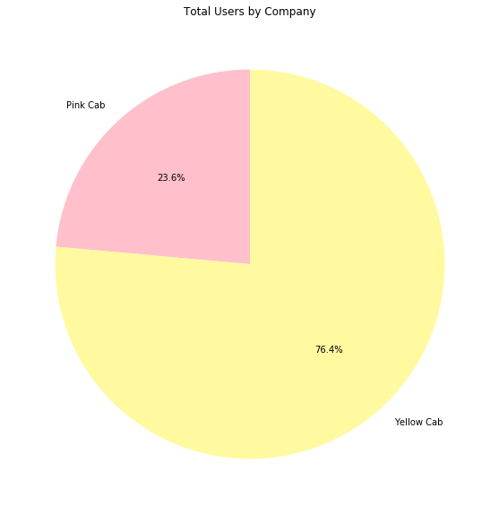


```python
df.plot(x="Company", y=["Profit", "KM Travelled"])
plt.show()
```


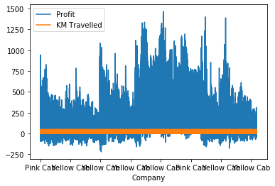


```python
pinkCab = df[df["Company"] == "Pink Cab"]
pinkCab.head()
```


<div>
<style scoped>
    .dataframe tbody tr th:only-of-type {
        vertical-align: middle;
    }

    .dataframe tbody tr th {
        vertical-align: top;
    }

    .dataframe thead th {
        text-align: right;
    }
</style>
<table border="1" class="dataframe">
  <thead>
    <tr style="text-align: right;">
      <th></th>
      <th>Transaction ID</th>
      <th>Date of Travel</th>
      <th>Company</th>
      <th>City</th>
      <th>KM Travelled</th>
      <th>Price Charged</th>
      <th>Cost of Trip</th>
      <th>Travel Date</th>
      <th>Population</th>
      <th>Users</th>
      <th>Customer ID</th>
      <th>Gender</th>
      <th>Age</th>
      <th>Income (USD/Month)</th>
      <th>Payment_Mode</th>
      <th>Profit</th>
    </tr>
  </thead>
  <tbody>
    <tr>
      <th>0</th>
      <td>10000011</td>
      <td>42377</td>
      <td>Pink Cab</td>
      <td>ATLANTA GA</td>
      <td>30.45</td>
      <td>370.95</td>
      <td>313.635</td>
      <td>2016-01-10</td>
      <td>814,885</td>
      <td>24,701</td>
      <td>29290</td>
      <td>Male</td>
      <td>28</td>
      <td>10813</td>
      <td>Card</td>
      <td>57.315</td>
    </tr>
    <tr>
      <th>1</th>
      <td>10000012</td>
      <td>42375</td>
      <td>Pink Cab</td>
      <td>ATLANTA GA</td>
      <td>28.62</td>
      <td>358.52</td>
      <td>334.854</td>
      <td>2016-01-08</td>
      <td>814,885</td>
      <td>24,701</td>
      <td>27703</td>
      <td>Male</td>
      <td>27</td>
      <td>9237</td>
      <td>Card</td>
      <td>23.666</td>
    </tr>
    <tr>
      <th>2</th>
      <td>10000013</td>
      <td>42371</td>
      <td>Pink Cab</td>
      <td>ATLANTA GA</td>
      <td>9.04</td>
      <td>125.20</td>
      <td>97.632</td>
      <td>2016-01-04</td>
      <td>814,885</td>
      <td>24,701</td>
      <td>28712</td>
      <td>Male</td>
      <td>53</td>
      <td>11242</td>
      <td>Cash</td>
      <td>27.568</td>
    </tr>
    <tr>
      <th>3</th>
      <td>10000014</td>
      <td>42376</td>
      <td>Pink Cab</td>
      <td>ATLANTA GA</td>
      <td>33.17</td>
      <td>377.40</td>
      <td>351.602</td>
      <td>2016-01-09</td>
      <td>814,885</td>
      <td>24,701</td>
      <td>28020</td>
      <td>Male</td>
      <td>23</td>
      <td>23327</td>
      <td>Cash</td>
      <td>25.798</td>
    </tr>
    <tr>
      <th>4</th>
      <td>10000015</td>
      <td>42372</td>
      <td>Pink Cab</td>
      <td>ATLANTA GA</td>
      <td>8.73</td>
      <td>114.62</td>
      <td>97.776</td>
      <td>2016-01-05</td>
      <td>814,885</td>
      <td>24,701</td>
      <td>27182</td>
      <td>Male</td>
      <td>33</td>
      <td>8536</td>
      <td>Card</td>
      <td>16.844</td>
    </tr>
  </tbody>
</table>
</div>


```python
yellowCab = df[df["Company"] == "Yellow Cab"]
yellowCab.head()
```


<div>
<style scoped>
    .dataframe tbody tr th:only-of-type {
        vertical-align: middle;
    }

    .dataframe tbody tr th {
        vertical-align: top;
    }

    .dataframe thead th {
        text-align: right;
    }
</style>
<table border="1" class="dataframe">
  <thead>
    <tr style="text-align: right;">
      <th></th>
      <th>Transaction ID</th>
      <th>Date of Travel</th>
      <th>Company</th>
      <th>City</th>
      <th>KM Travelled</th>
      <th>Price Charged</th>
      <th>Cost of Trip</th>
      <th>Travel Date</th>
      <th>Population</th>
      <th>Users</th>
      <th>Customer ID</th>
      <th>Gender</th>
      <th>Age</th>
      <th>Income (USD/Month)</th>
      <th>Payment_Mode</th>
      <th>Profit</th>
    </tr>
  </thead>
  <tbody>
    <tr>
      <th>6</th>
      <td>10000384</td>
      <td>42371</td>
      <td>Yellow Cab</td>
      <td>ATLANTA GA</td>
      <td>33.93</td>
      <td>1341.17</td>
      <td>464.1624</td>
      <td>2016-01-04</td>
      <td>814,885</td>
      <td>24,701</td>
      <td>27602</td>
      <td>Male</td>
      <td>23</td>
      <td>8542</td>
      <td>Card</td>
      <td>877.0076</td>
    </tr>
    <tr>
      <th>7</th>
      <td>10000385</td>
      <td>42378</td>
      <td>Yellow Cab</td>
      <td>ATLANTA GA</td>
      <td>42.18</td>
      <td>1412.06</td>
      <td>516.2832</td>
      <td>2016-01-11</td>
      <td>814,885</td>
      <td>24,701</td>
      <td>27594</td>
      <td>Male</td>
      <td>28</td>
      <td>3901</td>
      <td>Cash</td>
      <td>895.7768</td>
    </tr>
    <tr>
      <th>8</th>
      <td>10000386</td>
      <td>42372</td>
      <td>Yellow Cab</td>
      <td>ATLANTA GA</td>
      <td>10.60</td>
      <td>364.62</td>
      <td>132.2880</td>
      <td>2016-01-05</td>
      <td>814,885</td>
      <td>24,701</td>
      <td>27884</td>
      <td>Male</td>
      <td>32</td>
      <td>13505</td>
      <td>Cash</td>
      <td>232.3320</td>
    </tr>
    <tr>
      <th>9</th>
      <td>10000387</td>
      <td>42375</td>
      <td>Yellow Cab</td>
      <td>ATLANTA GA</td>
      <td>26.75</td>
      <td>838.00</td>
      <td>333.8400</td>
      <td>2016-01-08</td>
      <td>814,885</td>
      <td>24,701</td>
      <td>28533</td>
      <td>Male</td>
      <td>39</td>
      <td>28386</td>
      <td>Cash</td>
      <td>504.1600</td>
    </tr>
    <tr>
      <th>10</th>
      <td>10000388</td>
      <td>42376</td>
      <td>Yellow Cab</td>
      <td>ATLANTA GA</td>
      <td>46.02</td>
      <td>1540.61</td>
      <td>596.4192</td>
      <td>2016-01-09</td>
      <td>814,885</td>
      <td>24,701</td>
      <td>29039</td>
      <td>Male</td>
      <td>35</td>
      <td>17761</td>
      <td>Card</td>
      <td>944.1908</td>
    </tr>
  </tbody>
</table>
</div>


```python
figure, (ax1, ax2) = plt.subplots(1, 2)
# For Pink Cab
ax1.plot(pinkCab["KM Travelled"], pinkCab["Profit"])
ax1.set_title("Pink Cab")
  
# For Yellow Cab
ax2.plot(yellowCab["KM Travelled"], yellowCab["Profit"])
ax2.set_title("Yellow Cab")

plt.show()
```


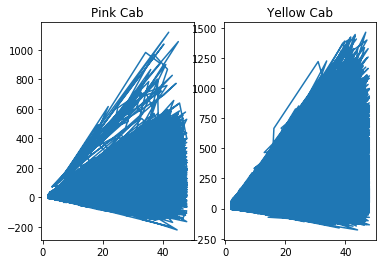


```python
dummy=pinkCab.groupby("KM Travelled")

```


```python
dummy.head()
```


<div>
<style scoped>
    .dataframe tbody tr th:only-of-type {
        vertical-align: middle;
    }

    .dataframe tbody tr th {
        vertical-align: top;
    }

    .dataframe thead th {
        text-align: right;
    }
</style>
<table border="1" class="dataframe">
  <thead>
    <tr style="text-align: right;">
      <th></th>
      <th>Transaction ID</th>
      <th>Date of Travel</th>
      <th>Company</th>
      <th>City</th>
      <th>KM Travelled</th>
      <th>Price Charged</th>
      <th>Cost of Trip</th>
      <th>Travel Date</th>
      <th>Population</th>
      <th>Users</th>
      <th>Customer ID</th>
      <th>Gender</th>
      <th>Age</th>
      <th>Income (USD/Month)</th>
      <th>Payment_Mode</th>
      <th>Profit</th>
    </tr>
  </thead>
  <tbody>
    <tr>
      <th>0</th>
      <td>10000011</td>
      <td>42377</td>
      <td>Pink Cab</td>
      <td>ATLANTA GA</td>
      <td>30.45</td>
      <td>370.95</td>
      <td>313.635</td>
      <td>2016-01-10</td>
      <td>814,885</td>
      <td>24,701</td>
      <td>29290</td>
      <td>Male</td>
      <td>28</td>
      <td>10813</td>
      <td>Card</td>
      <td>57.315</td>
    </tr>
    <tr>
      <th>1</th>
      <td>10000012</td>
      <td>42375</td>
      <td>Pink Cab</td>
      <td>ATLANTA GA</td>
      <td>28.62</td>
      <td>358.52</td>
      <td>334.854</td>
      <td>2016-01-08</td>
      <td>814,885</td>
      <td>24,701</td>
      <td>27703</td>
      <td>Male</td>
      <td>27</td>
      <td>9237</td>
      <td>Card</td>
      <td>23.666</td>
    </tr>
    <tr>
      <th>2</th>
      <td>10000013</td>
      <td>42371</td>
      <td>Pink Cab</td>
      <td>ATLANTA GA</td>
      <td>9.04</td>
      <td>125.20</td>
      <td>97.632</td>
      <td>2016-01-04</td>
      <td>814,885</td>
      <td>24,701</td>
      <td>28712</td>
      <td>Male</td>
      <td>53</td>
      <td>11242</td>
      <td>Cash</td>
      <td>27.568</td>
    </tr>
    <tr>
      <th>3</th>
      <td>10000014</td>
      <td>42376</td>
      <td>Pink Cab</td>
      <td>ATLANTA GA</td>
      <td>33.17</td>
      <td>377.40</td>
      <td>351.602</td>
      <td>2016-01-09</td>
      <td>814,885</td>
      <td>24,701</td>
      <td>28020</td>
      <td>Male</td>
      <td>23</td>
      <td>23327</td>
      <td>Cash</td>
      <td>25.798</td>
    </tr>
    <tr>
      <th>4</th>
      <td>10000015</td>
      <td>42372</td>
      <td>Pink Cab</td>
      <td>ATLANTA GA</td>
      <td>8.73</td>
      <td>114.62</td>
      <td>97.776</td>
      <td>2016-01-05</td>
      <td>814,885</td>
      <td>24,701</td>
      <td>27182</td>
      <td>Male</td>
      <td>33</td>
      <td>8536</td>
      <td>Card</td>
      <td>16.844</td>
    </tr>
    <tr>
      <th>...</th>
      <td>...</td>
      <td>...</td>
      <td>...</td>
      <td>...</td>
      <td>...</td>
      <td>...</td>
      <td>...</td>
      <td>...</td>
      <td>...</td>
      <td>...</td>
      <td>...</td>
      <td>...</td>
      <td>...</td>
      <td>...</td>
      <td>...</td>
      <td>...</td>
    </tr>
    <tr>
      <th>71269</th>
      <td>10221908</td>
      <td>42990</td>
      <td>Pink Cab</td>
      <td>CHICAGO IL</td>
      <td>10.44</td>
      <td>120.81</td>
      <td>113.796</td>
      <td>2017-09-14</td>
      <td>1,955,130</td>
      <td>164,468</td>
      <td>3957</td>
      <td>Female</td>
      <td>18</td>
      <td>21647</td>
      <td>Card</td>
      <td>7.014</td>
    </tr>
    <tr>
      <th>74510</th>
      <td>10248911</td>
      <td>43042</td>
      <td>Pink Cab</td>
      <td>CHICAGO IL</td>
      <td>44.08</td>
      <td>564.69</td>
      <td>493.696</td>
      <td>2017-11-05</td>
      <td>1,955,130</td>
      <td>164,468</td>
      <td>3507</td>
      <td>Female</td>
      <td>33</td>
      <td>9899</td>
      <td>Cash</td>
      <td>70.994</td>
    </tr>
    <tr>
      <th>77714</th>
      <td>10274930</td>
      <td>43079</td>
      <td>Pink Cab</td>
      <td>CHICAGO IL</td>
      <td>7.28</td>
      <td>79.84</td>
      <td>86.632</td>
      <td>2017-12-12</td>
      <td>1,955,130</td>
      <td>164,468</td>
      <td>5635</td>
      <td>Female</td>
      <td>55</td>
      <td>22084</td>
      <td>Card</td>
      <td>-6.792</td>
    </tr>
    <tr>
      <th>80844</th>
      <td>10299632</td>
      <td>43141</td>
      <td>Pink Cab</td>
      <td>CHICAGO IL</td>
      <td>10.10</td>
      <td>120.46</td>
      <td>102.010</td>
      <td>2018-02-12</td>
      <td>1,955,130</td>
      <td>164,468</td>
      <td>3364</td>
      <td>Male</td>
      <td>53</td>
      <td>24430</td>
      <td>Card</td>
      <td>18.450</td>
    </tr>
    <tr>
      <th>90527</th>
      <td>10370844</td>
      <td>43350</td>
      <td>Pink Cab</td>
      <td>CHICAGO IL</td>
      <td>10.10</td>
      <td>130.70</td>
      <td>112.110</td>
      <td>2018-09-09</td>
      <td>1,955,130</td>
      <td>164,468</td>
      <td>4688</td>
      <td>Male</td>
      <td>39</td>
      <td>18913</td>
      <td>Card</td>
      <td>18.590</td>
    </tr>
  </tbody>
</table>
<p>4370 rows × 16 columns</p>
</div>


## Profit analysis per KM


```python
label = ["{0} - {1}".format(i, i + 9) for i in range(0, 50, 10)]

df["KM Range"] = pd.cut(df['KM Travelled'], range(0,55, 10), right=False, labels=label)

pivot_KM_profit = df.pivot_table(index = ["KM Range"], columns = 'Company', values = 'Profit', aggfunc = 'sum')

pivot_KM_profit.fillna(0, inplace=True)
ax = pivot_KM_profit.plot.barh(stacked = True, figsize = (15,10), color=["#FFC0CB","#FFFAA0"])
labels = []
for j in pivot_KM_profit.columns:
    for i in pivot_KM_profit.index:
        if ((j == 0) and (pivot_KM_profit.loc[i][j] < 10) and (pivot_KM_profit.loc[i][j] < sum(pivot_KM_profit.loc[i]))):
            label = ""
        else:                                                                                                                       
            label = str(round((pivot_KM_profit.loc[i][j]/sum(pivot_KM_profit.loc[i]))*100,1)) + "% "
        labels.append(label)


plt.title("PROFIT ANALISYS PER KM ")
plt.show()

```


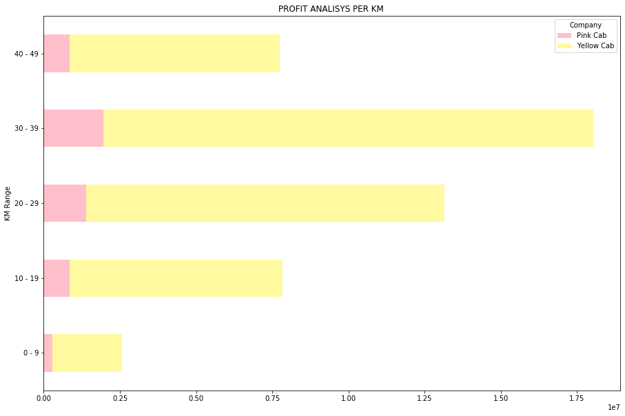


## Cost of Trip and Price Charged Comparison


```python
label_Cost = ["{0} - {1}".format(i, i + 49) for i in range(0, 700, 50)]

df["Cost of Trip Grouped"] = pd.cut(df['Cost of Trip'], range(0,710, 50), right=False, labels=label_Cost)
df.head()
```


<div>
<style scoped>
    .dataframe tbody tr th:only-of-type {
        vertical-align: middle;
    }

    .dataframe tbody tr th {
        vertical-align: top;
    }

    .dataframe thead th {
        text-align: right;
    }
</style>
<table border="1" class="dataframe">
  <thead>
    <tr style="text-align: right;">
      <th></th>
      <th>Transaction ID</th>
      <th>Date of Travel</th>
      <th>Company</th>
      <th>City</th>
      <th>KM Travelled</th>
      <th>Price Charged</th>
      <th>Cost of Trip</th>
      <th>Travel Date</th>
      <th>Population</th>
      <th>Users</th>
      <th>Customer ID</th>
      <th>Gender</th>
      <th>Age</th>
      <th>Income (USD/Month)</th>
      <th>Payment_Mode</th>
      <th>Profit</th>
      <th>KM Range</th>
      <th>Cost of Trip Grouped</th>
    </tr>
  </thead>
  <tbody>
    <tr>
      <th>0</th>
      <td>10000011</td>
      <td>42377</td>
      <td>Pink Cab</td>
      <td>ATLANTA GA</td>
      <td>30.45</td>
      <td>370.95</td>
      <td>313.635</td>
      <td>2016-01-10</td>
      <td>814,885</td>
      <td>24,701</td>
      <td>29290</td>
      <td>Male</td>
      <td>28</td>
      <td>10813</td>
      <td>Card</td>
      <td>57.315</td>
      <td>30 - 39</td>
      <td>300 - 349</td>
    </tr>
    <tr>
      <th>1</th>
      <td>10000012</td>
      <td>42375</td>
      <td>Pink Cab</td>
      <td>ATLANTA GA</td>
      <td>28.62</td>
      <td>358.52</td>
      <td>334.854</td>
      <td>2016-01-08</td>
      <td>814,885</td>
      <td>24,701</td>
      <td>27703</td>
      <td>Male</td>
      <td>27</td>
      <td>9237</td>
      <td>Card</td>
      <td>23.666</td>
      <td>20 - 29</td>
      <td>300 - 349</td>
    </tr>
    <tr>
      <th>2</th>
      <td>10000013</td>
      <td>42371</td>
      <td>Pink Cab</td>
      <td>ATLANTA GA</td>
      <td>9.04</td>
      <td>125.20</td>
      <td>97.632</td>
      <td>2016-01-04</td>
      <td>814,885</td>
      <td>24,701</td>
      <td>28712</td>
      <td>Male</td>
      <td>53</td>
      <td>11242</td>
      <td>Cash</td>
      <td>27.568</td>
      <td>0 - 9</td>
      <td>50 - 99</td>
    </tr>
    <tr>
      <th>3</th>
      <td>10000014</td>
      <td>42376</td>
      <td>Pink Cab</td>
      <td>ATLANTA GA</td>
      <td>33.17</td>
      <td>377.40</td>
      <td>351.602</td>
      <td>2016-01-09</td>
      <td>814,885</td>
      <td>24,701</td>
      <td>28020</td>
      <td>Male</td>
      <td>23</td>
      <td>23327</td>
      <td>Cash</td>
      <td>25.798</td>
      <td>30 - 39</td>
      <td>350 - 399</td>
    </tr>
    <tr>
      <th>4</th>
      <td>10000015</td>
      <td>42372</td>
      <td>Pink Cab</td>
      <td>ATLANTA GA</td>
      <td>8.73</td>
      <td>114.62</td>
      <td>97.776</td>
      <td>2016-01-05</td>
      <td>814,885</td>
      <td>24,701</td>
      <td>27182</td>
      <td>Male</td>
      <td>33</td>
      <td>8536</td>
      <td>Card</td>
      <td>16.844</td>
      <td>0 - 9</td>
      <td>50 - 99</td>
    </tr>
  </tbody>
</table>
</div>


```python
pivotCostTripPrice = df.pivot_table(index = ["Cost of Trip Grouped"], columns = 'Company', values = 'Price Charged')

pivotCostTripPrice.fillna(0, inplace=True)
ax = pivotCostTripPrice.plot.barh(stacked = True, figsize = (15,10), color=["#FFC0CB","#FFFAA0"])

plt.title("Cost of Trip and Price Charged comparison")
plt.show()
```


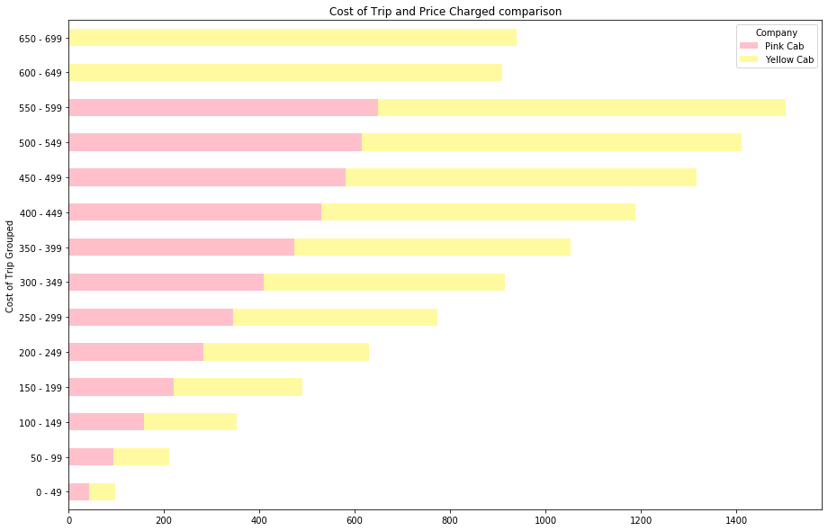


```python
yellowCab.head()
```


<div>
<style scoped>
    .dataframe tbody tr th:only-of-type {
        vertical-align: middle;
    }

    .dataframe tbody tr th {
        vertical-align: top;
    }

    .dataframe thead th {
        text-align: right;
    }
</style>
<table border="1" class="dataframe">
  <thead>
    <tr style="text-align: right;">
      <th></th>
      <th>Transaction ID</th>
      <th>Date of Travel</th>
      <th>Company</th>
      <th>City</th>
      <th>KM Travelled</th>
      <th>Price Charged</th>
      <th>Cost of Trip</th>
      <th>Travel Date</th>
      <th>Population</th>
      <th>Users</th>
      <th>Customer ID</th>
      <th>Gender</th>
      <th>Age</th>
      <th>Income (USD/Month)</th>
      <th>Payment_Mode</th>
      <th>Profit</th>
    </tr>
  </thead>
  <tbody>
    <tr>
      <th>6</th>
      <td>10000384</td>
      <td>42371</td>
      <td>Yellow Cab</td>
      <td>ATLANTA GA</td>
      <td>33.93</td>
      <td>1341.17</td>
      <td>464.1624</td>
      <td>2016-01-04</td>
      <td>814,885</td>
      <td>24,701</td>
      <td>27602</td>
      <td>Male</td>
      <td>23</td>
      <td>8542</td>
      <td>Card</td>
      <td>877.0076</td>
    </tr>
    <tr>
      <th>7</th>
      <td>10000385</td>
      <td>42378</td>
      <td>Yellow Cab</td>
      <td>ATLANTA GA</td>
      <td>42.18</td>
      <td>1412.06</td>
      <td>516.2832</td>
      <td>2016-01-11</td>
      <td>814,885</td>
      <td>24,701</td>
      <td>27594</td>
      <td>Male</td>
      <td>28</td>
      <td>3901</td>
      <td>Cash</td>
      <td>895.7768</td>
    </tr>
    <tr>
      <th>8</th>
      <td>10000386</td>
      <td>42372</td>
      <td>Yellow Cab</td>
      <td>ATLANTA GA</td>
      <td>10.60</td>
      <td>364.62</td>
      <td>132.2880</td>
      <td>2016-01-05</td>
      <td>814,885</td>
      <td>24,701</td>
      <td>27884</td>
      <td>Male</td>
      <td>32</td>
      <td>13505</td>
      <td>Cash</td>
      <td>232.3320</td>
    </tr>
    <tr>
      <th>9</th>
      <td>10000387</td>
      <td>42375</td>
      <td>Yellow Cab</td>
      <td>ATLANTA GA</td>
      <td>26.75</td>
      <td>838.00</td>
      <td>333.8400</td>
      <td>2016-01-08</td>
      <td>814,885</td>
      <td>24,701</td>
      <td>28533</td>
      <td>Male</td>
      <td>39</td>
      <td>28386</td>
      <td>Cash</td>
      <td>504.1600</td>
    </tr>
    <tr>
      <th>10</th>
      <td>10000388</td>
      <td>42376</td>
      <td>Yellow Cab</td>
      <td>ATLANTA GA</td>
      <td>46.02</td>
      <td>1540.61</td>
      <td>596.4192</td>
      <td>2016-01-09</td>
      <td>814,885</td>
      <td>24,701</td>
      <td>29039</td>
      <td>Male</td>
      <td>35</td>
      <td>17761</td>
      <td>Card</td>
      <td>944.1908</td>
    </tr>
  </tbody>
</table>
</div>


## Cost of trip for Gender in both Company


```python
sb.catplot(x="Company", y="Cost of Trip", hue="Gender", kind="bar", data=df)
```


    <seaborn.axisgrid.FacetGrid at 0x222398054c8>


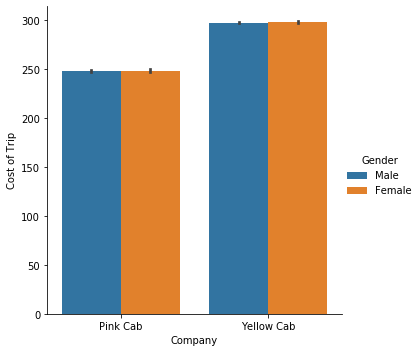


## Price Charged vs Cost of Trip for both Cab Companies


```python
sb.scatterplot(x="Price Charged", y="Cost of Trip", hue="Company", data=df, palette=["#FFC0CB","#FFFAA0"])
```


    <matplotlib.axes._subplots.AxesSubplot at 0x2223e5a4408>


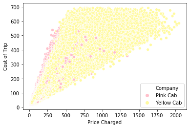


```python
sb.scatterplot(x="Price Charged", y="Cost of Trip", data=yellowCab, color="#FFFAA0")
```


    <matplotlib.axes._subplots.AxesSubplot at 0x2223e5b4a88>


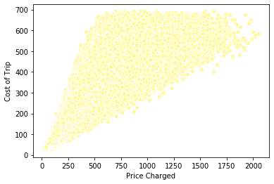


```python
# sb.set(rc={'figure.figsize':(25,25)})
plt.figure(figsize=(30, 30))
fig, ax = plt.subplots()
ax.xaxis.set_ticks(np.arange(50, 1700, 50))
ax.yaxis.set_ticks(np.arange(100, 600, 20))
sb.scatterplot(x="Price Charged", y="Cost of Trip", data=pinkCab, s=15, color="pink")
fig.set_size_inches(25,15)
# ax.set(ylim=(1, 800))

```


    <Figure size 2160x2160 with 0 Axes>


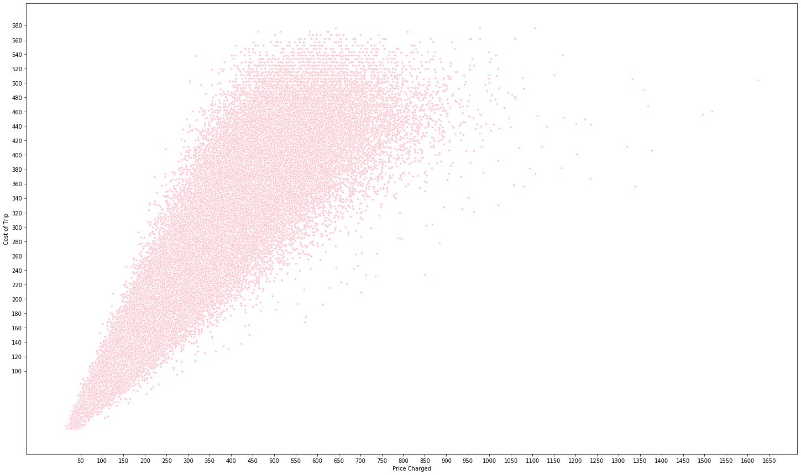


```python
# sb.set(rc={'figure.figsize':(30,30)})
plt.figure(figsize=(30, 30), dpi=80)
fig, ax = plt.subplots()
sb.scatterplot(x="Price Charged", y="Cost of Trip", hue="Company", data=df, palette=["#FFC0CB","#FFFAA0"])
fig.set_size_inches(15,15)
ax.set(ylim=(1, 800))
ax.xaxis.set_ticks(np.arange(100, 2000, 80))
ax.yaxis.set_ticks(np.arange(100, 800, 20))
```


    [<matplotlib.axis.YTick at 0x22237fbd748>,
     <matplotlib.axis.YTick at 0x22237fbae88>,
     <matplotlib.axis.YTick at 0x22237fea588>,
     <matplotlib.axis.YTick at 0x22237fff788>,
     <matplotlib.axis.YTick at 0x22237ffe248>,
     <matplotlib.axis.YTick at 0x22237ffeb48>,
     <matplotlib.axis.YTick at 0x22238005708>,
     <matplotlib.axis.YTick at 0x22238009048>,
     <matplotlib.axis.YTick at 0x22238009dc8>,
     <matplotlib.axis.YTick at 0x2223800c948>,
     <matplotlib.axis.YTick at 0x22237fb3708>,
     <matplotlib.axis.YTick at 0x22238039a48>,
     <matplotlib.axis.YTick at 0x22238035ac8>,
     <matplotlib.axis.YTick at 0x22238028f88>,
     <matplotlib.axis.YTick at 0x2223803c908>,
     <matplotlib.axis.YTick at 0x2223803e308>,
     <matplotlib.axis.YTick at 0x2223803edc8>,
     <matplotlib.axis.YTick at 0x22238044a08>,
     <matplotlib.axis.YTick at 0x22238047588>,
     <matplotlib.axis.YTick at 0x2223804b188>,
     <matplotlib.axis.YTick at 0x2223804bc48>,
     <matplotlib.axis.YTick at 0x2223803ef48>,
     <matplotlib.axis.YTick at 0x222380288c8>,
     <matplotlib.axis.YTick at 0x2223804ec88>,
     <matplotlib.axis.YTick at 0x22238051688>,
     <matplotlib.axis.YTick at 0x22238055308>,
     <matplotlib.axis.YTick at 0x22238055d08>,
     <matplotlib.axis.YTick at 0x22238058888>,
     <matplotlib.axis.YTick at 0x2223805c408>,
     <matplotlib.axis.YTick at 0x2223b2800c8>,
     <matplotlib.axis.YTick at 0x2223b280ac8>,
     <matplotlib.axis.YTick at 0x2223805ce48>,
     <matplotlib.axis.YTick at 0x22238051f48>,
     <matplotlib.axis.YTick at 0x2223b2859c8>,
     <matplotlib.axis.YTick at 0x2223b2883c8>]


    <Figure size 2400x2400 with 0 Axes>


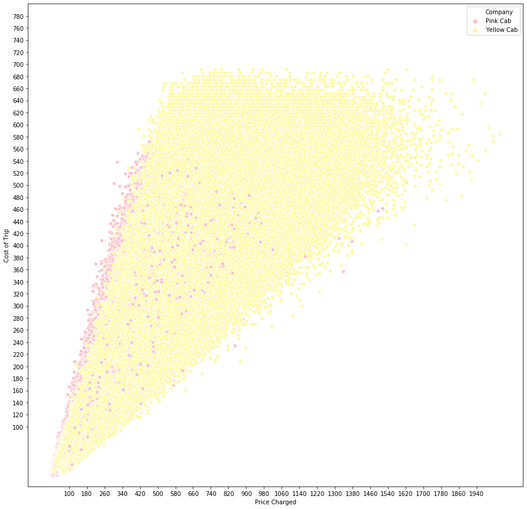


```python
fig, ax = plt.subplots()
sb.barplot(x='Cost of Trip Grouped', y='Price Charged', data=df, palette=["#FFC0CB","#FFFAA0"], hue='Company')
fig.set_size_inches(15,15)
```


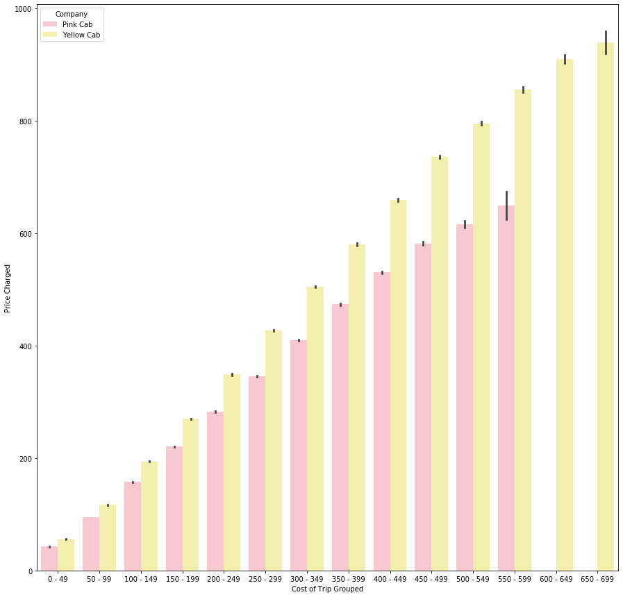


```python
fig, ax = plt.subplots()
sb.barplot(x='Cost of Trip Grouped', y='KM Travelled', data=df, palette=["#FFC0CB","#FFFAA0"], hue='Company');
ax.yaxis.set_ticks(np.arange(0, 50, 5))
fig.set_size_inches(15,15)
```


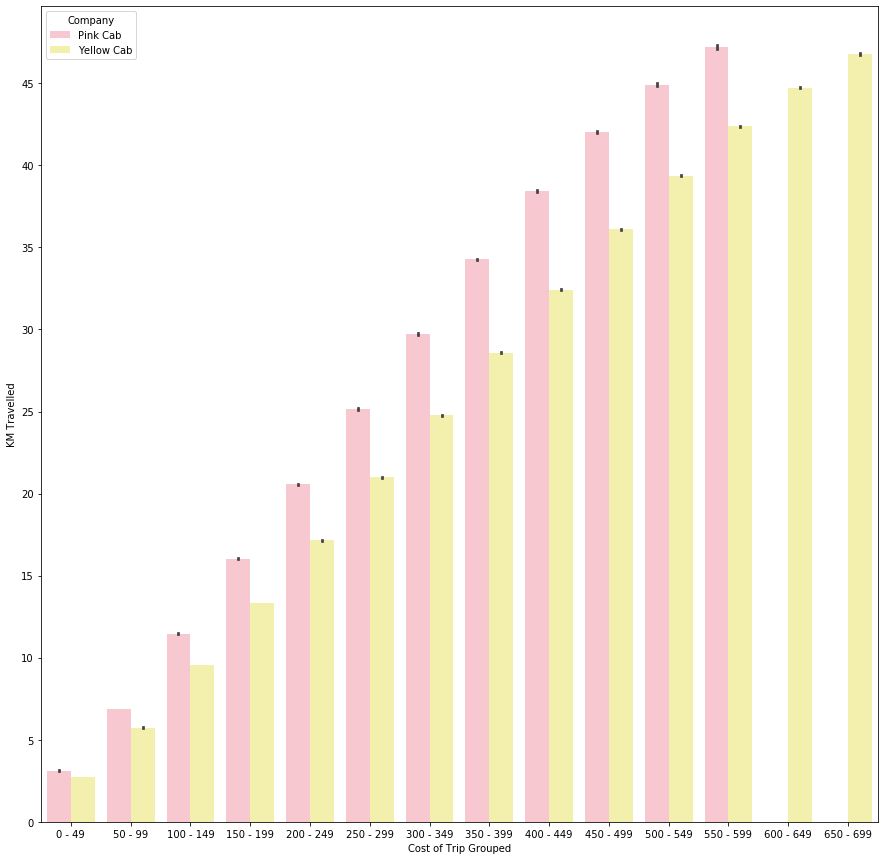


## Hypothesis


```python
sb.pairplot(df, hue="Company")
```


    <seaborn.axisgrid.PairGrid at 0x2223ed02b48>


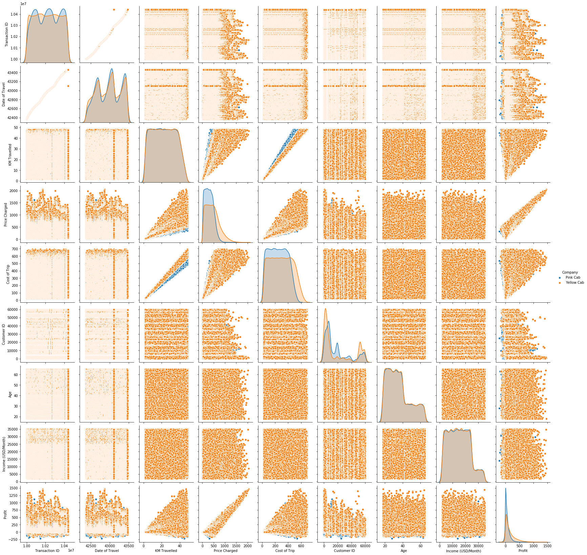


## Regression Hypothesis 

### Regression Hypothesis for Price Charged and Profit for different Cab


```python
ax = sb.regplot(x="Price Charged", y="Profit", data=yellowCab, color="gold")
```


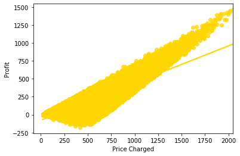


```python
ax = sb.regplot(x="Price Charged", y="Profit", data=pinkCab, color="pink")
```


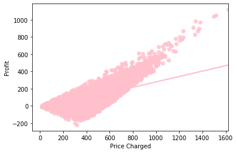


### Regression Hypothesis for Price charged and Cost of Trip for both Cab company


```python
ax = sb.regplot(x="Price Charged", y="Cost of Trip", data=yellowCab, color="gold")
```


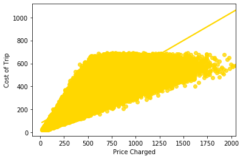


```python
ax = sb.regplot(x="Price Charged", y="Cost of Trip", data=pinkCab, color="pink")
```


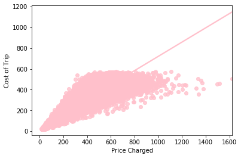


## CONCLUSION

#### The following evaluations have been made regarding both Cab companies:

1. Most Users (~77%) prefer travelling with Yellow cab than Pink cab
2. There are users who take long distance trip with Yellow Cab
3. Yellow cab more profit than what is made by both companies
4. Yellow cab has relatively more profit each year
5. Yellow cab charged higher than Pink cab

#### Thus Yellow Cab company is good for XYZ company to invest and expand it's business

